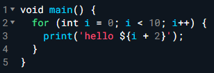
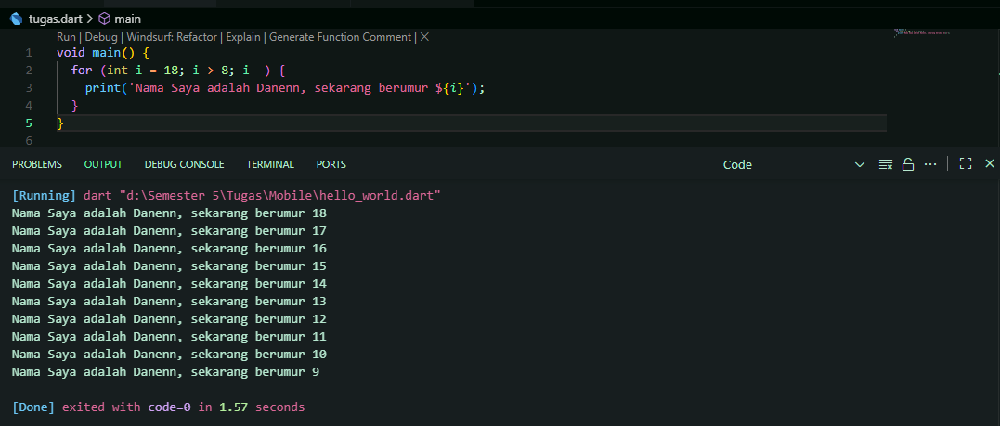

<h1 align="center">Laporan Praktikum Week 2</h1>

> Oleh:  
Danendra Nayaka Passadhi  
TI-3H / 07

## Teori
### Hello World Dart Style
~~~Dart
void main() { 
   for (int i = 0; i < 5; i++) { 
     print('hello ${i + 1}'); 
   } 
}
~~~

**Output yang dikeluarkan:**  

  

## Tugas Praktikum
### Soal 1
Modifikasilah kode pada baris 3 di VS Code atau Editor Code favorit Anda berikut ini agar mendapatkan keluaran (output) sesuai yang diminta!

  

Output yang diminta (Gantilah Fulan dengan nama Anda):

  

### `Jawaban`
**Kode Program:**
~~~Dart
void main() {
  for (int i = 18; i > 8; i--) {
    print('Nama Saya adalah Danenn, sekarang berumur ${i}');
  }
}
~~~
**Output**

 

### Soal 2
Mengapa sangat penting untuk memahami bahasa pemrograman Dart sebelum kita menggunakan framework Flutter ? Jelaskan!

### `Jawaban`
Memahami Dart penting sebelum memakai Flutter karena Flutter berjalan sepenuhnya di atas Dart. Dengan menguasai Dart, kita bisa lebih mudah membangun logika aplikasi, mengelola state, dan menyesuaikan widget.

 

### Soal 3
Rangkumlah materi dari codelab ini menjadi poin-poin penting yang dapat Anda gunakan untuk membantu proses pengembangan aplikasi mobile menggunakan framework Flutter.

### `Jawaban`
- **Fitur Utama**
  - Tooling → alat bantu (IDE, analisis kode, paket) untuk mempermudah pengembangan.
  - Garbage collection → otomatis membuang memori yang tidak terpakai.
  - Statically typed → type-safe & type inference, membantu deteksi bug saat kompilasi.
  - Portability → bisa dijalankan di web (JavaScript) maupun native (ARM/x86).

- **Eksekusi Kode**
Dapat dilakukan melalui Dart VM (Secara langsung) maupun dikompilasi ke JavaScript untuk web.
- **Kompilasi**
  - **Just-In-Time (JIT)**: kompilasi saat dijalankan, cocok untuk pengembangan & debugging, mendukung hot reload.
  - **Ahead-Of-Time (AOT)**: kompilasi sebelum dijalankan, menghasilkan performa tinggi untuk aplikasi produksi, dan memberikan performa tinggi, tapi tanpa debugging & hot reload.

 

### Soal 4
Buatlah penjelasan dan contoh eksekusi kode tentang perbedaan Null Safety dan Late variabel !

### `Jawaban`
**1. Null Safety**  
Null safety memastikan variabel tidak bisa bernilai **`null`** kecuali kita secara eksplisit mengizinkannya dengan tanda **`?`**. Tujuannya adalah mencegah error **`null reference`** (error paling umum saat variabel dipakai padahal kosong).  
**Contoh Kode Program:**
~~~Dart
void main() {
  String name = "Fulan";        // Tidak bisa null
  String? nickname;             // Bisa null karena pakai tanda ?

  print(name);                  // Output: Fulan
  print(nickname);              // Output: null

  nickname = "Danenn";
  print(nickname);              // Output: Danenn
}
~~~
 

**2. Late Variabel**  
**`late`** digunakan untuk memberi tahu Dart bahwa variabel akan diinisialisasi nanti sebelum dipakai. Hal ini dapat berguna jika nilai baru diketahui di runtime atau butuh inisialisasi berat.   
**Contoh Kode Program:**
~~~Dart
void main() {
  late String greeting;         // Deklarasi tanpa nilai awal
                                // greeting belum bisa dipakai sebelum diisi

  greeting = "Halo, selamat datang!";
  print(greeting);             // Output: Halo, selamat datang!
}
~~~
