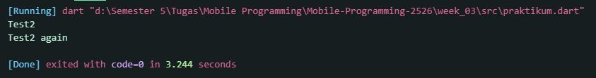
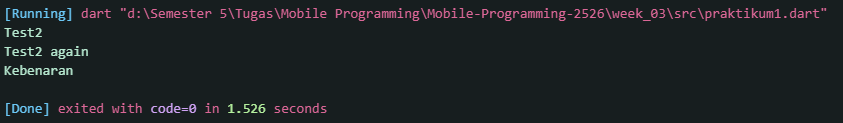
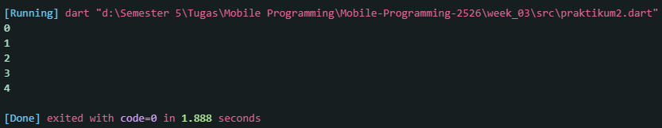
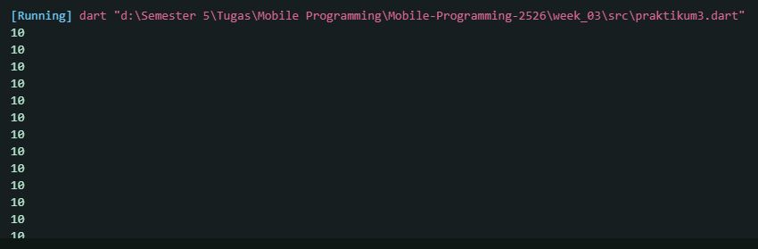
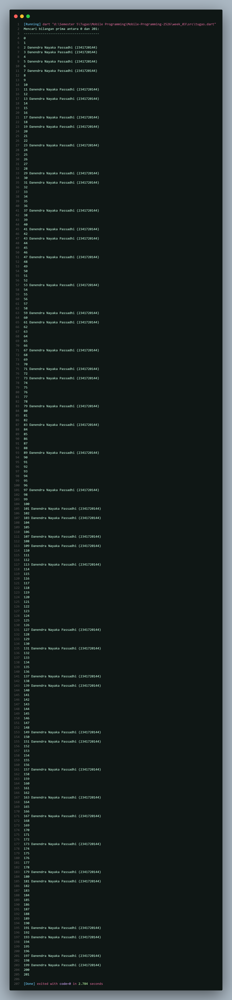

<h1 align="center">Laporan Praktikum Week 3</h1>
<h4>
Oleh: <br>

| Nama                      | Kelas | Absen |
| ------------------------- | ----- | --- |
| Danenddra Nayaka Passadhi | TI-3H | 07  |

## Praktikum 1 <br> Menerapkan Control Flows ("if/else")
### Langkah 1

```Dart
void main() {
  // Langkah 1
  String test = "test2";
  if (test == "test1") {
    print("Test1");
  } else if (test == "test2") {
    print("Test2");
  } else {
    print("Something else");
  }

  if (test == "test2") print("Test2 again");
}
```

### Langkah 2

**Output yang dikeluarkan:** <br>

➜ Kode ini pertama-tama memberikan nilai "test2" ke variabel `test`. Kemudian, blok `if-else` if akan memeriksa kondisi tersebut dan karena nilainya cocok, ia akan mencetak "Test2". Setelah itu, ada sebuah pernyataan if kedua yang berdiri sendiri. Karena kondisinya juga terpenuhi (nilai `test` masih "test2"), maka ia akan mencetak "Test2 again". Hasil akhirnya adalah dua baris teks yang tercetak.

### Langkah 3
```Dart
void main() {
  // Langkah 1
  String test = "test2";
  if (test == "test1") {
    print("Test1");
  } else if (test == "test2") {
    print("Test2");
  } else {
    print("Something else");
  }

  if (test == "test2") print("Test2 again");

  // Langkah 3
  String testt = "true";
  if (testt == "true") {
    print("Kebenaran");
   }
}
```

**Output:** <br>


## Praktikum 2  <br> Menerapkan Perulangan "while" dan "do-while"
### Langkah 1
~~~Dart
void main() {
  // Langkah 1
  int counter = 0;
  while (counter < 5) {
  print(counter);
  counter++;
  }
}
~~~

### Langkah 2
**Output yang dikeluarkan:**

➜ Kode ini menjalankan sebuah perulangan yang dimulai dari variabel `counter` yang bernilai 0. Program akan terus mencetak `counter` dan menaikkan nilainya sebesar satu, selama kondisi `counter < 5` terpenuhi. Hasilnya akan mencetak angka 0 hingga 4 secara berurutan pada baris baru.

### Langkah 3
~~~Dart
void main() {
  // Langkah 1
  int counter = 0;
  while (counter < 5) {
  print(counter);
  counter++;
  }

  // Langkah 3
  do {
    print(counter);
    counter++;
  } while (counter < 10);
}
~~~

## Praktikum 3 <br> Menerapkan Perulangan "for" dan "break-continue"
### Langkah 1
~~~Dart
void main() {
  // Langkah 1
  int Index = 0;
  for (Index = 10; Index < 27; Index) {
    print(Index);
  }
}
~~~

### Langkah 2
**Output yang dikeluarkan:**

➜ Terjadi *infinity loop* dikarenakan tidak adanya operasi perubahan nilai pada bagian ketiga dari struktur for loop. Bagian tersebut (Index) hanya memanggil variabel tanpa melakukan apa-apa, sehingga nilai Index akan selalu tetap 10. Akibatnya, kondisi Index < 27 akan selamanya bernilai benar (true), dan program akan terus-menerus mencetak angka 10 tanpa henti. 

### Langkah 3
~~~Dart
void main() {
  // Langkah 1
  for (int index = 10; index < 27; index++) {
    print(index);

    //Langkah 3
    if (index == 21) {
      break;
    } else if (index > 1 || index < 7) {
      continue;
    }
    print(index);
  }
}
~~~

### Tugas Praktikum
**Buatlah sebuah program yang dapat menampilkan bilangan prima dari angka 0 sampai 201 menggunakan Dart. Ketika bilangan prima ditemukan, maka tampilkan nama lengkap dan NIM Anda.**
~~~Dart
void main() {
  String namaLengkap = "Danendra Nayaka Passadhi";
  String nim = "2341720144";

  print("Mencari bilangan prima antara 0 dan 201:");
  print("----------------------------------------");

  for (int i = 0; i <= 201; i++) {
    if (isPrima(i)) {
      print('$i $namaLengkap ($nim)');
    } else {
      print('$i');
    }
  }
}

bool isPrima(int n) {
  if (n <= 1) {
    return false;
  }
  for (int i = 2; i * i <= n; i++) {
    if (n % i == 0) {
      return false;
    }
  }
  return true;
}
~~~

**Output kode program:**
