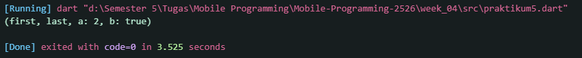

<h1 align="center">Laporan Praktikum Week 4</h1>
<h4>
Oleh: <br>

| Nama                      | Kelas | Absen |
| ------------------------- | ----- | ---   |
| Danendra Nayaka Passadhi  | TI-3H | 07    |

## Praktikum 1 <br> Eksperimen Tipe Data List
### Langkah 1

```Dart
void main() {
  var list = [1, 2, 3];
  assert(list.length == 3);
  assert(list[1] == 2);
  print(list.length);
  print(list[1]);

  list[1] = 1;
  assert(list[1] == 1);
  print(list[1]);
}
```

### Langkah 2
**Output yang dikeluarkan:**


### Langkah 3
```Dart
void main() {
  final list = [null, 'Danendra', '2341720144', null, null];
  assert(list.length == 3);
  assert(list[1] == 2);
  print(list.length);
  print(list[1]);

  list[1] = '2341720144';
  assert(list[1] == 1);
  print(list[1]);
}
```

**Output:**


➜ Tidak terjadi error karena kode assert merupakan kode untuk debugging, jadi akan mengalami error jika dilakukan debugging. <br>
➜ Tipe data private seharusnya tidak dapat diganti nilainya. Tetapi dalam kasus ini, isi tetap dapat diganti karena final pada sebuah list tidak membuat isi list menjadi permanen, melainkan hanya membuat variabel list itu sendiri tidak bisa diisi (di-assign) dengan list yang baru.

Hasil Debugging:


Jika dilakukan pada kode assert, akan menjadi seperti berikut:
```Dart
void main() {
  final list = [null, 'Danendra', '2341720144', null, null];
  assert(list.length == 5);
  assert(list[1] == 'Danendra');
  print(list.length);
  print(list[1]);

  list[1] = '2341720144';
  assert(list[1] == '2341720144');
  print(list[1]);
}
```

Dengan hasil sebagai berikut:


## Praktikum 2 <br> Eksperimen Tipe Data Set
### Langkah 1
```Dart
void main() {
  var halogens = {'fluorine', 'chlorine', 'bromine', 'iodine', 'astatine'};
  print(halogens);
}
```

## Langkah 2
**Output:**


## Langkah 3
```Dart
void main() {
  var halogens = {'fluorine', 'chlorine', 'bromine', 'iodine', 'astatine'};
  print(halogens);

  var names1 = <String>{};
  Set<String> names2 = {}; // This works, too.
  var names3 = {}; // Creates a map, not a set.

  print(names1);
  print(names2);
  print(names3);
}
```

Output:


➜ Tidak terjadi error, tetapi `var names3 = {};` tidak membuat sebuah Set (himpunan), melainkan membuat sebuah Map (peta). Karena tidak ada tipe data yang dideklarasikan secara eksplisit, Dart akan menganggap kurung kurawal {} sebagai Map kosong secara default.

Perbaikan :
```Dart
void main() {
  var halogens = {'fluorine', 'chlorine', 'bromine', 'iodine', 'astatine'};
  print(halogens);

  var names1 = <String>{};
  Set<String> names2 = {}; // This works, too.
  var names3 = {}; // Creates a map, not a set.

  names1.add('Danendra');
  names1.add('2341720144');

  names2.addAll(['Danendra', '2341720144']);

  print(names1);
  print(names2);
  print(names3);
}
```

Output:


## Praktikum 3 <br> Eksperimen Tipe Data Maps
### Langkah 1

```Dart
void main() {
  var gifts = {
    // Key:    Value
    'first': 'partridge',
    'second': 'turtledoves',
    'fifth': 1
  };

  var nobleGases = {
    2: 'helium',
    10: 'neon',
    18: 2,
  };

  print(gifts);
  print(nobleGases);
}
```

### Langkah 2
Output:


### Langkah 3
```Dart
void main() {
  var gifts = {
    // Key:    Value
    'first': 'partridge',
    'second': 'turtledoves',
    'fifth': 1
  };

  var nobleGases = {
    2: 'helium',
    10: 'neon',
    18: 2,
  };

  var mhs1 = Map<String, String>();
  gifts['first'] = 'partridge';
  gifts['second'] = 'turtledoves';
  gifts['fifth'] = 'golden rings';

  var mhs2 = Map<int, String>();
  nobleGases[2] = 'helium';
  nobleGases[10] = 'neon';
  nobleGases[18] = 'argon';

  print(gifts);
  print(nobleGases);
  print(mhs1);
  print(mhs2);
}
```

Output:

➜ Tidak terjadi error, hanya saja kode membuat sebuah Map kosong baru yang diberi nama mhs1 melalui `var mhs1 = Map<String, String>();`. Namun, di baris-baris berikutnya, kode tidak memasukkan data ke dalam mhs1. Sebaliknya, kode justru memasukkan data ke map lain yang bernama gifts. 

## Praktikum 4 <br> Eksperimen Tipe Data List: Spread dan Control-flow Operators
### Langkah 1

```Dart
void main() {
  var list = [1, 2, 3];
  var list2 = [0, ...list];
  print(list);
  print(list2);
  print(list2.length);
}
```

### Langkah 2
**Output:**


### Langkah 3
```Dart
void main() {
  var list = [1, 2, 3];
  var list2 = [0, ...list];
  print(list);
  print(list2);
  print(list2.length);

  var list1 = [1, 2, null];
  print(list1);
  var list3 = [0, ...?list1];
  print(list3.length);
}
```

Output:


Variabel list berisi NIM dengan **Spread Operator**:
```Dart
void main() {
  // Spread Operator
  var listNIM = [2,3,4,1,7,2,0,1,4,4];
  var listNIMSet = [...listNIM];

  print(listNIMSet);
}
```

Output:


### Langkah 4
```Dart
void main() {
  bool promoActive = true;
  var nav = ['Home', 'Furniture', 'Plants', if (promoActive) 'Outlet'];
  print(nav);
}
```

Hasil ketika `promoActive = true`:


Hasil ketika `promoActive = false`:


### Langkah 5
```Dart
void main() {
  var login = 'Manager';
  var nav2 = ['Home', 'Furniture', 'Plants', if (login case 'Manager') 'Inventory'];
  print(nav2);
}
```

Output: <br>


**Jika variabel `login` mempunyai kondisi lain**
Kode:
```Dart
void main() {
  var login = 'Manager';
  var nav2 = ['Home','Furniture','Plants', if (login case 'CEO') 'Inventory'];
  print(nav2);
}
```

Output:


### Langkah 6
```Dart
void main() {
  var listOfInts = [1, 2, 3];
  var listOfStrings = ['#0', for (var i in listOfInts) '#$i'];
  assert(listOfStrings[1] == '#1');
  print(listOfStrings);
}
```

Output: <br>


➜ Collection for memungkinkan untuk melakukan perulangan pada sebuah collection dan menghasilkan elemen baru untuk setiap item dalam iterasi tersebut, yang kemudian langsung dimasukkan ke dalam list yang sedang dibuat.

## Praktikum 5 <br> Eksperimen Tipe Data Records
### Langkah 1

```Dart
void main() {
  var record = ('first', a: 2, b: true, 'last');
  print(record);
}
```

### Langkah 2


### Langkah 3
```Dart
void main() {
  var record = (1, 2);
  print(tukar(record));
}

(int, int) tukar((int, int) record) {
  var (a, b) = record;
  return (b, a);
}
```

Output:


### Langkah 4
```Dart
void main() {
  // Record type annotation in a variable declaration:
  (String, int) mahasiswa = ('Danendra', 2341720144);
  print(mahasiswa);
}
```

Output:


### Langkah 5
```Dart
  void main() {
  var mahasiswa2 = ('Danendra', a: 2, b: true, 2341720144);

  print(mahasiswa2.$1);
  print(mahasiswa2.a); // Prints 2
  print(mahasiswa2.b); // Prints true
  print(mahasiswa2.$2);
}
```

Output:


## Tugas Praktikum
1. **Silakan selesaikan Praktikum 1 sampai 5, lalu dokumentasikan berupa screenshot hasil pekerjaan Anda beserta penjelasannya!** <br>
➜ Sudah tertera setiap praktikumnya.
2. **Jelaskan yang dimaksud Functions dalam bahasa Dart!** <br>
➜ **Functions** adalah blok kode yang dapat digunakan kembali untuk melakukan tugas tertentu. Tujuannya dapat berupa menghindari duplikasi kode dengan menulis sekali namun digunakan berkali-kali ataupun juga memecah program yang besar menjadi bagian kecil sehingga lebih mudah dipahami.
3. **Jelaskan jenis-jenis parameter di Functions beserta contoh sintaksnya!** <br>
  • **Named parameters:** Parameter ini dibungkus dengan kurung kurawal {}. Urutan saat pemanggilan tidak penting, dan secara default bersifat opsional (nullable). <br>
  Contoh sintaks:
  
  • **Optional positional parameters:** Membungkus sekumpulan parameter fungsi dalam `[]` menandainya sebagai parameter posisi opsional. Jika tidak diberikan nilai default, tipenya harus dapat berupa null karena nilai defaultnya adalah `null`. <br>
  Contoh sintaks:
  
4. **Jelaskan maksud Functions sebagai first-class objects beserta contoh sintaknya!** <br>
➜ **Functions sebagai first-class objects** bermaksud fungsi diperlakukan sama seperti tipe data lainnya (seperti int, String, atau List). Artinya, fungsi dapat disimpan dalam sebuah variabel, dijadikan argumen untuk fungsi lain, ataupun dikembalikan sebagai hasil dari fungsi lain. <br>
Contoh sintaks:

5. **Apa itu Anonymous Functions? Jelaskan dan berikan contohnya!** <br>
➜ **Anonymous Functions** adalah fungsi yang tidak memiliki nama. Biasanya untuk menjadi argumen bagi fungsi tingkat tinggi (higher-order functions) seperti `forEach`, `map`, atau `where`. <br>
Contoh sintaks:

6. **Jelaskan perbedaan Lexical scope dan Lexical closures! Berikan contohnya!** <br>
➜ **Lexical scope**: adalah aturan yang menentukan di mana sebuah variabel dapat diakses berdasarkan lokasi fisik kode tersebut ditulis. Sederhananya, fungsi di dalam (inner function) dapat mengakses variabel yang dideklarasikan di fungsi luar (outer function) atau di lingkup yang lebih tinggi. <br>
Contoh:
 <br>
➜ **Lexical closures**: adalah objek fungsi yang mengingat lingkup leksikalnya (variabel-variabel di sekitarnya) bahkan ketika fungsi tersebut dieksekusi di luar lingkup aslinya. Closure "menutup" atau "membungkus" variabel-variabel tersebut. <br>

7. **Jelaskan dengan contoh cara membuat return multiple value di Functions!**
➜ Caranya adalah dengan menggunakan **records**. Dengan menggunakan records, bisa mengembalikan beberapa nilai secara type-safe (tipe datanya jelas) tanpa perlu membuat kelas khusus atau menggunakan Map yang kurang aman dari segi tipe data. <br>
Contoh:
