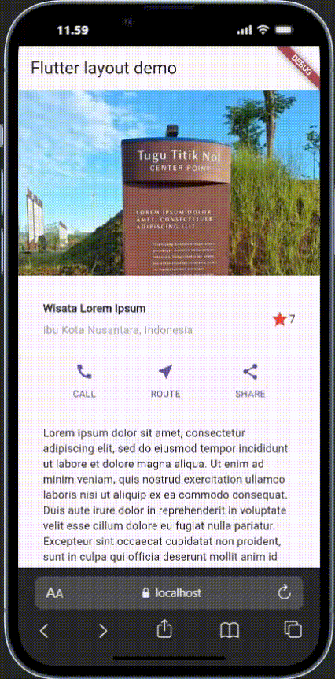
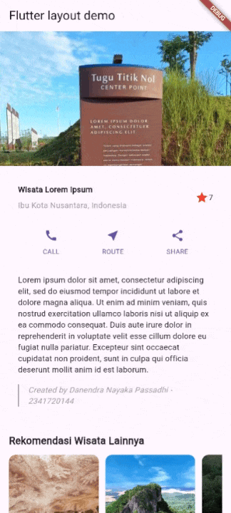
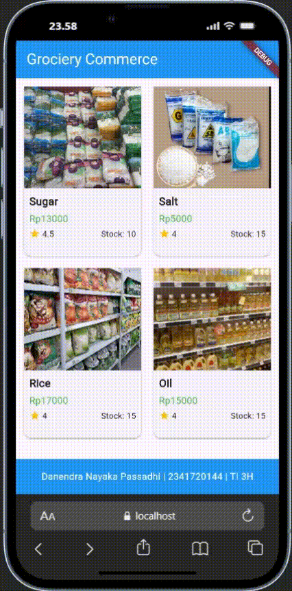

<h1 align="center">Laporan Praktikum Week 6</h1>
<h4>
Oleh: <br>

| Nama                     | Kelas | Absen |
| ------------------------ | ----- | ----- |
| Danendra Nayaka Passadhi | TI-3H | 07    |

## **Project 1** <br> - Membangun Layout di Flutter <br> - Implementasi button row <br> - Implementasi text section <br> - Implementasi image section

**Kode Program:**
```Dart
import 'package:flutter/material.dart';

void main() => runApp(const MyApp());

class MyApp extends StatelessWidget {
  const MyApp({super.key});

  Column _buildButtonColumn(Color color, IconData icon, String label) {
    return Column(
      mainAxisSize: MainAxisSize.min,
      mainAxisAlignment: MainAxisAlignment.center,
      children: [
        Icon(icon, color: color),
        Container(
          margin: const EdgeInsets.only(top: 8),
          child: Text(
            label,
            style: TextStyle(
              fontSize: 12,
              fontWeight: FontWeight.w400,
              color: color,
            ),
          ),
        ),
      ],
    );
  }

  @override
  Widget build(BuildContext context) {
    Widget titleSection = Container(
      padding: const EdgeInsets.all(32),
      child: Row(
        children: [
          Expanded(
            child: Column(
              crossAxisAlignment: CrossAxisAlignment.start,
              children: [
                Container(
                  padding: const EdgeInsets.only(bottom: 8),
                  child: const Text(
                    'Wisata Lorem Ipsum',
                    style: TextStyle(fontWeight: FontWeight.bold),
                  ),
                ),
                Text(
                  'Ibu Kota Nusantara, Indonesia',
                  style: TextStyle(color: Colors.grey),
                ),
              ],
            ),
          ),
          Icon(Icons.star, color: Colors.red),
          const Text('7'),
        ],
      ),
    );

    Color color = Theme.of(context).primaryColor;

    Widget buttonSection = Row(
      mainAxisAlignment: MainAxisAlignment.spaceEvenly,
      children: [
        _buildButtonColumn(color, Icons.call, 'CALL'),
        _buildButtonColumn(color, Icons.near_me, 'ROUTE'),
        _buildButtonColumn(color, Icons.share, 'SHARE'),
      ],
    );

    Widget textSection = Container(
      padding: const EdgeInsets.all(32),
      child: Column(
        crossAxisAlignment: CrossAxisAlignment.start,
        children: [
          const Text(
            'Lorem ipsum dolor sit amet, consectetur adipiscing elit, sed do eiusmod tempor incididunt ut labore et dolore magna aliqua. Ut enim ad minim veniam, quis nostrud exercitation ullamco laboris nisi ut aliquip ex ea commodo consequat. Duis aute irure dolor in reprehenderit in voluptate velit esse cillum dolore eu fugiat nulla pariatur. Excepteur sint occaecat cupidatat non proident, sunt in culpa qui officia deserunt mollit anim id est laborum.',
            softWrap: true,
          ),
          const SizedBox(height: 16), // Spacer
          Container(
            padding: const EdgeInsets.only(left: 16),
            decoration: const BoxDecoration(
              border: Border(
                left: BorderSide(
                  color: Colors.grey,
                  width: 2,
                ),
              ),
            ),
            child: const Text(
              'Created by Danendra Nayaka Passadhi - 2341720144',
              style: TextStyle(
                color: Colors.grey,
                fontStyle: FontStyle.italic,
              ),
            ),
          ),
        ],
      ),
    );

    return MaterialApp(
      title: 'Flutter layout: Danendra Nayaka Passadhi dan 2341720144',
      home: Scaffold(
        appBar: AppBar(title: const Text('Flutter layout demo')),
        body: ListView(
          children: [
            Image.asset(
              'images/tugu_lorem_ipsum.jpg',
              width: 600,
              height: 240,
              fit: BoxFit.cover,
            ),
            titleSection,
            buttonSection,
            textSection,
          ],
        ),
      ),
    );
  }
}
```
**Hasil Visualisasi**



### Tugas Praktikum 1


---

## **Project 2**: Membangun Navigasi dan Rute di Flutter

**Kode Program pada Home Page:**
```Dart
import 'package:flutter/material.dart';
import 'package:projek2/models/item.dart';

class HomePage extends StatelessWidget {
  HomePage({Key? key}) : super(key: key);

  final List<Item> items = [
    Item(
      name: 'Sugar',
      price: 13000,
      image: 'images/sugar.jpeg',
      stock: 10,
      rating: 4.5,
    ),
    Item(
      name: 'Salt',
      price: 5000,
      image: 'images/salt.jpeg',
      stock: 15,
      rating: 4.0,
    ),
    Item(
      name: 'Rice',
      price: 17000,
      image: 'images/rice.jpeg',
      stock: 15,
      rating: 4.0,
    ),
    Item(
      name: 'Oil',
      price: 15000,
      image: 'images/oil.jpeg',
      stock: 15,
      rating: 4.0,
    ),
  ];

  @override
  Widget build(BuildContext context) {
    return Scaffold(
      appBar: AppBar(title: const Text('Grociery Commerce'), 
      elevation: 0,
      backgroundColor: Colors.blue,
      foregroundColor: Colors.white,
      ),
      body: Column(
        children: [
          Expanded(
            child: GridView.builder(
              padding: const EdgeInsets.all(8),
              gridDelegate: const SliverGridDelegateWithFixedCrossAxisCount(
                crossAxisCount: 2,
                childAspectRatio: 0.7,
                crossAxisSpacing: 10,
                mainAxisSpacing: 10,
              ),
              itemCount: items.length,
              itemBuilder: (context, index) {
                final item = items[index];
                return InkWell(
                  onTap: () {
                    Navigator.pushNamed(context, '/item', arguments: item);
                  },
                  child: Card(
                    elevation: 2,
                    child: Column(
                      crossAxisAlignment: CrossAxisAlignment.start,
                      children: [
                        Expanded(
                          flex: 3,
                          child: Container(
                            width: double.infinity,
                            decoration: BoxDecoration(
                              image: DecorationImage(
                                image: NetworkImage(item.image),
                                fit: BoxFit.cover,
                              ),
                            ),
                          ),
                        ),
                        Expanded(
                          flex: 2,
                          child: Padding(
                            padding: const EdgeInsets.all(8.0),
                            child: Column(
                              crossAxisAlignment: CrossAxisAlignment.start,
                              children: [
                                Text(
                                  item.name,
                                  style: const TextStyle(
                                    fontSize: 16,
                                    fontWeight: FontWeight.bold,
                                  ),
                                ),
                                const SizedBox(height: 4),
                                Text(
                                  'Rp${item.price}',
                                  style: const TextStyle(
                                    fontSize: 14,
                                    color: Colors.green,
                                  ),
                                ),
                                const SizedBox(height: 4),
                                Row(
                                  children: [
                                    Icon(
                                      Icons.star,
                                      size: 16,
                                      color: Colors.amber,
                                    ),
                                    Text(
                                      ' ${item.rating}',
                                      style: TextStyle(fontSize: 12),
                                    ),
                                    Spacer(),
                                    Text(
                                      'Stock: ${item.stock}',
                                      style: TextStyle(fontSize: 12),
                                    ),
                                  ],
                                ),
                              ],
                            ),
                          ),
                        ),
                      ],
                    ),
                  ),
                );
              },
            ),
          ),
          Container(
            padding: const EdgeInsets.all(16),
            decoration: BoxDecoration(
              color: Colors.blue,
            ),
            child: Row(
              mainAxisAlignment: MainAxisAlignment.center,
              children: [
                Text(
                  'Danendra Nayaka Passadhi | 2341720144 | TI 3H',
                  style: TextStyle(
                    fontSize: 14,
                    fontWeight: FontWeight.w500,
                    color: const Color.fromARGB(255, 255, 255, 255),
                  ),
                ),
              ],
            ),
          ),
        ],
      ),
    );
  }
}
```

**Kode Program pada Item Page:**
```Dart
import 'package:flutter/material.dart';
import 'package:projek2/models/item.dart';

class ItemPage extends StatelessWidget {
  const ItemPage({Key? key}) : super(key: key);

  @override
  Widget build(BuildContext context) {
    final itemArgs = ModalRoute.of(context)!.settings.arguments as Item;
    
    return Scaffold(
      appBar: AppBar(
        title: Text('Item Details'),
        backgroundColor: Colors.blue,
        foregroundColor: Colors.white,
      ),
      body: SingleChildScrollView(
        child: Column(
          crossAxisAlignment: CrossAxisAlignment.start,
          children: [
            Image.network(
              itemArgs.image,
              width: double.infinity,
              height: 300,
              fit: BoxFit.cover,
            ),
            Padding(
              padding: const EdgeInsets.all(16.0),
              child: Column(
                crossAxisAlignment: CrossAxisAlignment.start,
                children: [
                  Text(
                    itemArgs.name,
                    style: TextStyle(
                      fontSize: 24,
                      fontWeight: FontWeight.bold,
                    ),
                  ),
                  SizedBox(height: 8),
                  Text(
                    'Rp${itemArgs.price}',
                    style: TextStyle(
                      fontSize: 20,
                      color: Colors.green,
                    ),
                  ),
                  SizedBox(height: 16),
                  Row(
                    children: [
                      Icon(Icons.star, color: Colors.amber),
                      Text(' ${itemArgs.rating}'),
                      SizedBox(width: 20),
                      Icon(Icons.inventory),
                      Text(' Stock: ${itemArgs.stock}'),
                    ],
                  ),
                ],
              ),
            ),
          ],
        ),
      ),
    );
  }
}
```

**Hasil Visualisasi:**

