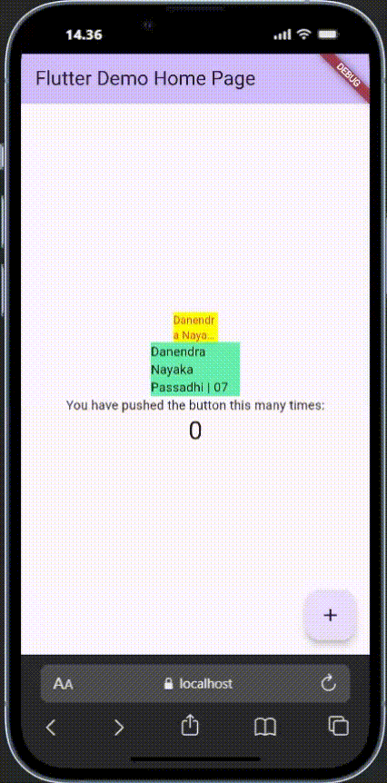

<h1 align="center">Laporan Praktikum Week 6</h1>
<h4>
Oleh: <br>

| Nama                     | Kelas | Absen |
| ------------------------ | ----- | ----- |
| Danendra Nayaka Passadhi | TI-3H | 07    |

## Praktikum 1

**Kode Program main.dart:**

```Dart
import 'package:flutter/material.dart';
import 'red_text_widget.dart';

void main() {
  runApp(const MyApp());
}

class MyApp extends StatelessWidget {
  const MyApp({super.key});

  // This widget is the root of your application.
  @override
  Widget build(BuildContext context) {
    return MaterialApp(
      title: 'Flutter Demo',
      theme: ThemeData(

        colorScheme: ColorScheme.fromSeed(seedColor: Colors.deepPurple),
      ),
      home: const MyHomePage(title: 'Flutter Demo Home Page'),
    );
  }
}

class MyHomePage extends StatefulWidget {
  const MyHomePage({super.key, required this.title});

  final String title;

  @override
  State<MyHomePage> createState() => _MyHomePageState();
}

class _MyHomePageState extends State<MyHomePage> {
  int _counter = 0;

  void _incrementCounter() {
    setState(() {
      _counter++;
    });
  }

  @override
  Widget build(BuildContext context) {
    return Scaffold(
      appBar: AppBar(
        backgroundColor: Theme.of(context).colorScheme.inversePrimary,
        title: Text(widget.title),
      ),
      body: Center(
        child: Column(
          mainAxisAlignment: MainAxisAlignment.center,
          children: <Widget>[
            Container(
              color: Colors.yellowAccent,
              width: 50,
              child: const RedTextWidget(
                text: 'Danendra Nayaka Passadhi | 07',
              ),
            ),
            Container(
              color: Colors.greenAccent,
              width: 100,
              child: const Text('Danendra Nayaka Passadhi | 07'),
            ),
            const Text('You have pushed the button this many times:'),
            Text(
              '$_counter',
              style: Theme.of(context).textTheme.headlineMedium,
            ),
          ],
        ),
      ),
      floatingActionButton: FloatingActionButton(
        onPressed: _incrementCounter,
        tooltip: 'Increment',
        child: const Icon(Icons.add),
      ), // This trailing comma makes auto-formatting nicer for build methods.
    );
  }
}
```

**Kode Program red_text_widget.dart:**

```Dart
import 'package:flutter/material.dart';
import 'package:auto_size_text/auto_size_text.dart';

class RedTextWidget extends StatelessWidget {
  final String text;

  const RedTextWidget({Key? key, required this.text}) : super(key: key);  // Update constructor

  @override
  Widget build(BuildContext context) {
    return AutoSizeText(
      text,
      style: const TextStyle(color: Colors.red, fontSize: 14),
      maxLines: 2,
      overflow: TextOverflow.ellipsis,
);
  }
}
```

**Visualisasi kode program:**



---

# Tugas Praktikum

### 1. Jelaskan maksud dari langkah 2 pada praktikum tersebut!

↪ Langkah tersebut merupakan penambahan plugin `auto_size_text` kedalam proyek Flutter.

### 2. Jelaskan maksud dari langkah 5 pada praktikum tersebut!

↪ Langkah tersebut merupakan mempersiapkan widget agar bisa menerima dan menyimpan data (berupa teks) dari luar. Dengan begitu, teks yang ditampilkan bisa menjadi dinamis/berbeda-beda setiap kali widget itu digunakan.

### 3. Pada langkah 6 terdapat dua widget yang ditambahkan, jelaskan fungsi dan perbedaannya!

↪ Langkah tersebut berfungsi untuk perbandingan hasil penggunaan plugin `RedTextWidget` dengan widget `Text`yang merupakan bawaan dari Flutter. <br>
↪ Perbedaan:

- Widget Kuning dengan teks berwarna merah, artinya menunjukkan masalah. `RedTextWidget` menyesuaikan ukuran font agar muat dalam satu baris dalam lebar dimensi 50px.
- Widget Hijau dengan teks berwarna hitam, artinya menunjukkan solusi. `Text` membungkus teks (text wrapping) ke baris baru jika tidak muat dalam lebar dimensi 100px.

### 4. Jelaskan maksud dari tiap parameter yang ada di dalam plugin auto_size_text berdasarkan tautan pada dokumentasi ini !

**Parameter Utama**
1. `key`: Parameter standar Flutter. Berguna untuk mengontrol bagaimana sebuah widget digantikan oleh widget lain di dalam widget tree. Biasanya jarang diubah.
2. `style`: Sama seperti pada widget Text biasa, parameter ini digunakan untuk mengatur gaya visual dari teks, seperti warna (color), ketebalan (fontWeight), jenis font (fontFamily), dan lain-lain.
3. `minFontSize`: Ukuran font terkecil yang diizinkan saat widget ini mencoba menyesuaikan teksnya.
4. `maxFontSize`: Ukuran font terbesar yang diizinkan.
5. `stepGranularity`: Interval pengecilan ukuran font.
6. `presetFontSizes`: Menyediakan daftar ukuran font yang spesifik untuk dicoba. AutoSizeText hanya akan menggunakan ukuran yang ada di dalam daftar ini.
7. `group`: Digunakan untuk menyamakan ukuran font pada beberapa AutoSizeText yang berbeda.
8. `maxLines`: Jumlah baris maksimal yang diizinkan untuk teks. AutoSizeText akan mencoba menyesuaikan ukuran font agar teksnya muat dalam jumlah baris ini.

**Parameter Perilaku Teks**
1. `textAlign`: Mengatur perataan teks secara horizontal (misal: TextAlign.center, TextAlign.left).
2. `textDirection`: Mengatur arah teks (misal: dari kiri ke kanan atau sebaliknya).
3. `softWrap`: Jika false, teks tidak akan pernah pindah ke baris baru secara otomatis. AutoSizeText akan memaksanya muat dalam satu baris.
4. `wrapWords`: Mengatur apakah kata yang tidak muat dalam satu baris harus dipisah. Sebaiknya biarkan true (default).

**Parameter Overflow**
1. `overflow`: Mengatur apa yang harus dilakukan jika teks masih tidak muat bahkan setelah mencapai minFontSize dan maxLines.
2. overflowReplacement: Jika terjadi overflow, alih-alih menampilkan teks yang terpotong, Anda bisa menampilkan widget lain sebagai gantinya.