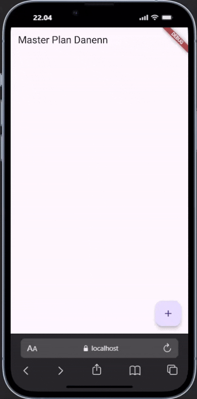
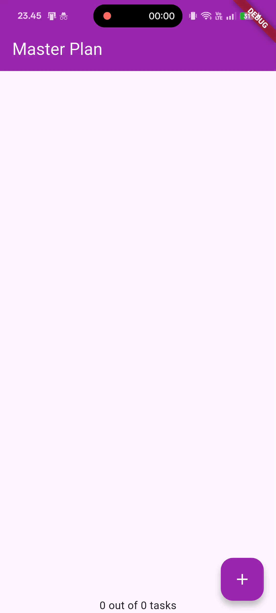

<h1 align="center">Laporan Praktikum Week 9</h1>
<h4>
Oleh:  

| Nama                     | Kelas | Absen |
| ------------------------ | ----- | ----- |
| Danendra Nayaka Passadhi | TI-3H | 07    |

## Tugas Praktikum 1: Dasar State dengan Model-View

2. Jelaskan maksud dari langkah 4 pada praktikum tersebut! Mengapa dilakukan demikian?  
↪ Maksudnya adalah untuk mengelompokkan dan mengekspor kembali (export) semua file lain yang ada di dalam folder `models` (yaitu task.dart dan plan.dart). Alasan utamanya adalah untuk menyederhanakan proses impor file di bagian lain aplikasi dan membuat struktur kode lebih rapi.

3. Mengapa perlu variabel plan di langkah 6 pada praktikum tersebut? Mengapa dibuat konstanta ?  
↪ variabel plan di dalam _PlanScreenState berfungsi sebagai sumber data utama (atau "state") untuk seluruh layar PlanScreen. Layar ini dirancang untuk menampilkan detail dari sebuah objek Plan, khususnya daftar tugas (List<Task>) yang ada di dalamnya, sehingga kita memerlukan variabel untuk "memegang" data plan yang sedang aktif ditampilkan.

    ↪ Inisialisasi konstanta adalah cara untuk memberikan nilai awal yang aman saat layar pertama kali dimuat. const Plan() akan membuat sebuah objek Plan default yang kosong dengan nama kosong dan daftar tugas yang juga kosong, yang penting untuk mencegah error null saat widget _buildList() pertama kali mencoba membaca data dari plan. 

4. Hasil dari langkah 9  

5. Apa kegunaan method pada Langkah 11 dan 13 dalam lifecyle state ?  
↪ `initState()` digunakan untuk "membuka" atau "membuat" sumber daya, sedangkan `dispose()` digunakan untuk "menutup" atau "membersihkannya" saat sudah tidak diperlukan lagi.

---

## Tugas Praktikum 2: InheritedWidget

2. Jelaskan mana yang dimaksud InheritedWidget pada langkah 1 tersebut! Mengapa yang digunakan InheritedNotifier?  
↪ `PlanProvider` pada dasarnya adalah sebuah `InheritedWidget`, karena ia mewarisi `InheritedNotifier` yang merupakan turunan khusus dari `InheritedWidget`.  
↪ Alasan menggunakan InheritedNotifier adalah untuk efisiensi, karena dirancang untuk "mendengarkan" perubahan pada ValueNotifier. Ketika data Plan di dalam ValueNotifier itu berubah, InheritedNotifier secara otomatis hanya akan me-rebuild widget-widget dependen (yang memanggil PlanProvider.of(context)) untuk menampilkan data baru, daripada me-rebuild setiap kali provider-nya di-build.

3. Jelaskan maksud dari method di langkah 3 pada praktikum tersebut! Mengapa dilakukan demikian?  
↪ Method tersebut merupakan getter yang berfungsi untuk menghitung data turunan dari `List<Task>`. Ini dilakukan agar logika perhitungan tetap berada di dalam model (Plan), sehingga kode UI Anda tetap bersih dan hanya perlu memanggil plan.completedCount atau plan.completenessMessage tanpa perlu tahu cara menghitungnya.

4. Hasil dari langkah 9  

---

## Tugas Praktikum 3: State di Multiple Screens

2. Berdasarkan Praktikum 3 yang telah Anda lakukan, jelaskan maksud dari gambar diagram berikut ini!  

↪ Diagram tersebut merupakan alur navigasi dari aplikasi **Master Plan**. Diagram menunjukkan bagaimana pengguna berpindah dari `PlanCreatorScreen`, yang merupakan layar utama tempat daftar rencana (plans) ditampilkan, ke `PlanScreen`, yang merupakan layar detail untuk menampilkan tugas-tugas (tasks) dari satu rencana yang dipilih. Perpindahan ini terjadi melalui aksi Navigator Push, yang biasanya dipicu saat pengguna mengetuk salah satu item rencana di `PlanCreatorScreen`.

3. Hasil dari langkah 14  
