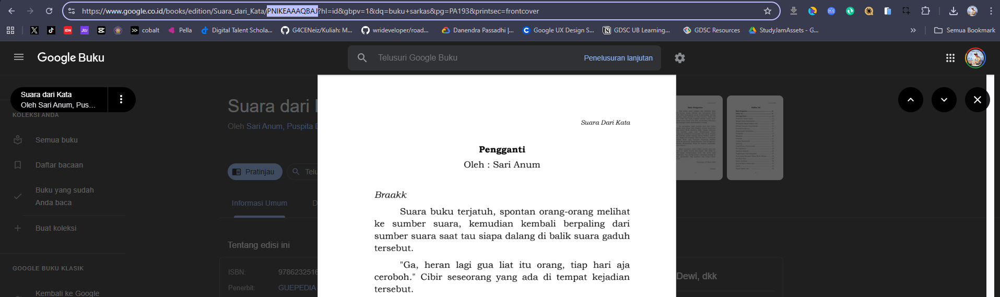
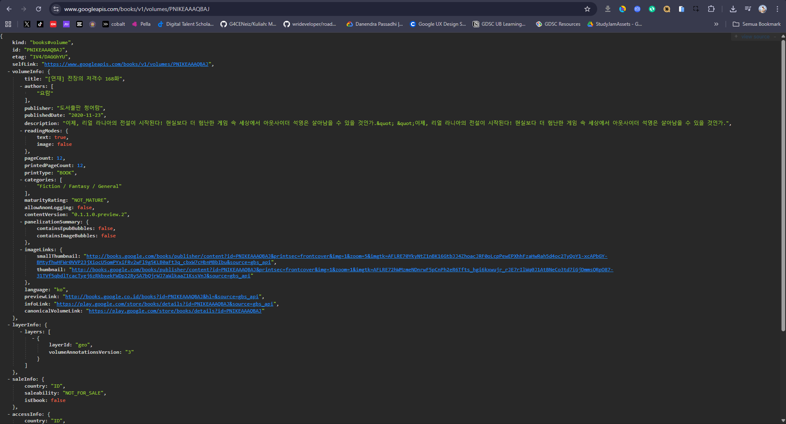
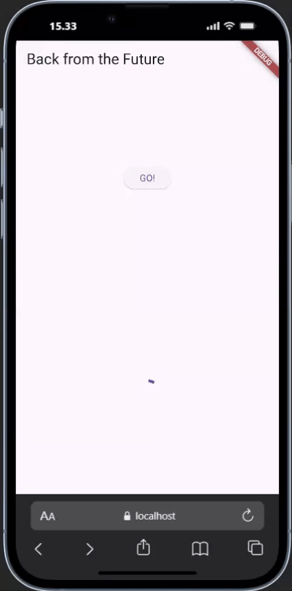

<h1 align="center">Laporan Praktikum Week 11 <br> 
<code>Pemrograman Asynchronous</code>
</h1>
<h4>
Oleh: <br>

| Nama                     | Kelas | Absen |
| ------------------------ | ----- | ----- |
| Danendra Nayaka Passadhi | TI-3H | 07    |

## Tugas Praktikum 1: <br> `Dasar State dengan Model-View`

> **Soal 1** <br>
> Tambahkan nama panggilan Anda pada title app sebagai identitas hasil pekerjaan Anda.

```Dart
@override
Widget build(BuildContext context) {
  return MaterialApp(
    title: 'Danenn',
    theme: ThemeData(
      primarySwatch: Colors.blue,
      visualDensity: VisualDensity.adaptivePlatformDensity,
    ),
    home: const FuturePage(),
  );
}
```

> **Soal 2**
> - Carilah judul buku favorit Anda di Google Books, lalu ganti ID buku pada variabel path di kode tersebut. Caranya ambil di URL browser Anda seperti gambar berikut ini.



> Kemudian cobalah akses di browser URI tersebut dengan lengkap seperti ini. Jika menampilkan data JSON, maka Anda telah berhasil. Lakukan capture milik Anda dan tulis di README pada laporan praktikum. Lalu lakukan commit dengan pesan "W11: Soal 2".



> **Soal 3**
> - Jelaskan maksud kode langkah 5 tersebut terkait `substring` dan `catchError`!

↪ Kode ini berfungsi untuk menjalankan getData(), dan berdasarkan hasilnya:
- Jika Sukses: Ambil body respons, potong 450 karakter pertamanya (substring), dan tampilkan.
- Jika Gagal: Ganti result dengan pesan kesalahan dan tampilkan pesan tersebut (catchError).

> - Capture hasil praktikum Anda berupa GIF dan lampirkan di README. Lalu lakukan commit dengan pesan "W11: Soal 3".

**Hasil Praktikum:** <br>


---

## Tugas Praktikum 2: <br> `Menggunakan await/async untuk menghindari callbacks`

> **Soal 4**
> - Jelaskan maksud kode langkah 1 dan 2 tersebut!

↪ **Langkah 1**: Berfungsi untuk mendefinisikan fungsi asinkron di dalam State dari sebuah widget (_FuturePageState). Tujuannya adalah untuk membuat simulasi tiga operasi pengambilan data atau pemrosesan yang membutuhkan waktu (masing-masing 3 detik). <br>
↪ **Langkah 2**: Berfungsi untuk menjumlahkan hasil asinkron dengan method `count()` yang telah didefinisikan sebelumnya.Tujuannya adalah untuk menjalankan tiga operasi asinkron secara berurutan dan menjumlahkan hasil akhirnya untuk kemudian ditampilkan.

> - Capture hasil praktikum Anda berupa GIF dan lampirkan di README. Lalu lakukan commit dengan pesan "W11: Soal 4".

**Hasil Praktikum:** <br>


