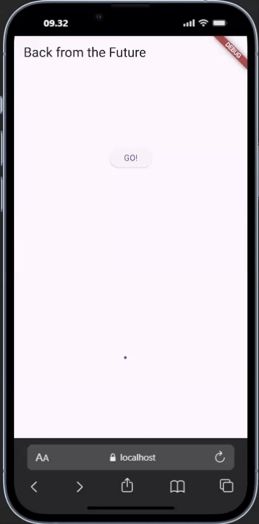

<h1 align="center">Laporan Praktikum Week 11 <br> 
<code>Pemrograman Asynchronous</code>
</h1>
<h4>
Oleh: <br>

| Nama                     | Kelas | Absen |
| ------------------------ | ----- | ----- |
| Danendra Nayaka Passadhi | TI-3H | 07    |

## Tugas Praktikum 1: <br> `Dasar State dengan Model-View`

> **Soal 1** <br>
> Tambahkan nama panggilan Anda pada title app sebagai identitas hasil pekerjaan Anda.

```Dart
@override
Widget build(BuildContext context) {
  return MaterialApp(
    title: 'Danenn',
    theme: ThemeData(
      primarySwatch: Colors.blue,
      visualDensity: VisualDensity.adaptivePlatformDensity,
    ),
    home: const FuturePage(),
  );
}
```

> **Soal 2**
> - Carilah judul buku favorit Anda di Google Books, lalu ganti ID buku pada variabel path di kode tersebut. Caranya ambil di URL browser Anda seperti gambar berikut ini.


> Kemudian cobalah akses di browser URI tersebut dengan lengkap seperti ini. Jika menampilkan data JSON, maka Anda telah berhasil. Lakukan capture milik Anda dan tulis di README pada laporan praktikum. Lalu lakukan commit dengan pesan "W11: Soal 2".


> **Soal 3**
> - Jelaskan maksud kode langkah 5 tersebut terkait `substring` dan `catchError`!

↪ Kode ini berfungsi untuk menjalankan getData(), dan berdasarkan hasilnya:
- Jika Sukses: Ambil body respons, potong 450 karakter pertamanya (substring), dan tampilkan.
- Jika Gagal: Ganti result dengan pesan kesalahan dan tampilkan pesan tersebut (catchError).

> - Capture hasil praktikum Anda berupa GIF dan lampirkan di README. Lalu lakukan commit dengan pesan "W11: Soal 3".

**Hasil Praktikum:** <br>


---

## Tugas Praktikum 2: <br> `Menggunakan await/async untuk menghindari callbacks`

> **Soal 4**
> - Jelaskan maksud kode langkah 1 dan 2 tersebut!

↪ **Langkah 1**: Berfungsi untuk mendefinisikan fungsi asinkron di dalam State dari sebuah widget (_FuturePageState). Tujuannya adalah untuk membuat simulasi tiga operasi pengambilan data atau pemrosesan yang membutuhkan waktu (masing-masing 3 detik). <br>
↪ **Langkah 2**: Berfungsi untuk menjumlahkan hasil asinkron dengan method `count()` yang telah didefinisikan sebelumnya.Tujuannya adalah untuk menjalankan tiga operasi asinkron secara berurutan dan menjumlahkan hasil akhirnya untuk kemudian ditampilkan.

> - Capture hasil praktikum Anda berupa GIF dan lampirkan di README. Lalu lakukan commit dengan pesan "W11: Soal 4".

**Hasil Praktikum:** <br>


---

## Tugas Praktikum 3: <br> `Menggunakan Completer di Future`

> **Soal 5**
> - Jelaskan maksud kode langkah 2 tersebut!

↪  Maksud kode pada langkah 2 adalah untuk membuat sebuah operasi asinkron yang berjalan selama 5 detik, dan hasilnya (nilai 42) dikirim kembali melalui mekanisme `Future` yang dikontrol secara manual:
1. Panggil getNumber() → segera mengembalikan sebuah Future yang kosong.
2. calculate() berjalan selama 5 detik di latar belakang.
3. Setelah 5 detik, calculate() memanggil completer.complete(42).
4. Pada saat itu, Future yang dikembalikan pada langkah 1 selesai dan memberikan nilai 42 kepada pemanggilnya.

> - Capture hasil praktikum Anda berupa GIF dan lampirkan di README. Lalu lakukan commit dengan pesan "W11: Soal 5".

**Hasil Praktikum:** <br>


> **Soal 6**
> - Jelaskan maksud perbedaan kode langkah 2 dengan langkah 5-6 tersebut!

↪  Perbedaan pada Metode calculate() (Langkah 2 vs. Langkah 5)
- Langkah 2: Hanya Sukses
```Dart
Future calculate() async {
  await Future.delayed(const Duration(seconds: 5));
  completer.complete(42); // Hanya menyelesaikan dengan nilai SUKSES
}
```
Metode ini hanya berfokus pada kasus sukses. Setelah 5 detik, completer diselesaikan dengan nilai 42. Jika terjadi runtime error di dalam calculate() (misalnya, jika Future.delayed gagal), exception tersebut tidak akan ditangkap dan Future yang dikembalikan oleh getNumber() akan gagal secara implisit.

- Langkah 5: Penanganan Kesalahan Eksplisit
```Dart
calculate() async {
  try {
    await new Future.delayed(const Duration(seconds: 5));
    completer.complete(42);
    // throw Exception(); // Jika diaktifkan, akan masuk ke blok catch
  } catch (_) {
    completer.completeError({}); // Menyelesaikan Future dengan KESALAHAN
  }
}
```
Metode ini memastikan bahwa apa pun yang terjadi, `Future` yang dikembalikan oleh `getNumber()` akan diselesaikan secara proper, baik dengan nilai sukses (42) atau dengan kesalahan.

> - Capture hasil praktikum Anda berupa GIF dan lampirkan di README. Lalu lakukan commit dengan pesan "W11: Soal 6".

**Hasil Praktikum:** <br>


---

## Tugas Praktikum 4: <br> `Memanggil Future secara paralel`

> **Soal 7**
> - Capture hasil praktikum Anda berupa GIF dan lampirkan di README. Lalu lakukan commit dengan pesan "W11: Soal 7".

**Hasil Praktikum:** <br>


> **Soal 8**
> - Jelaskan maksud perbedaan kode langkah 1 dan 4!

↪ Langkah 4 merupakan cara yang lebih ringkas dan bersih untuk mencapai fungsionalitas yang sama dengan Langkah 1. Langkah 1 menggunakan kelas FutureGroup (yang dulunya adalah cara untuk mengelola sekelompok Future), sedangkan langkah 4 menggunakan fungsi statis Future.wait, yang merupakan cara standar dan direkomendasikan di Dart. Kedua kode tersebut menjalankan returnOneAsync(), returnTwoAsync(), dan returnThreeAsync() secara bersamaan (parallel), dan menunggu hingga semua 3 detik penundaan selesai sebelum melanjutkan untuk memproses hasil penjumlahannya.