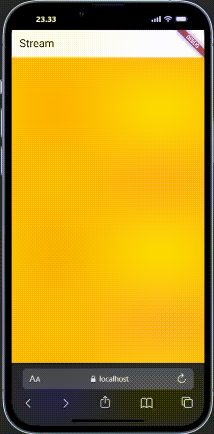
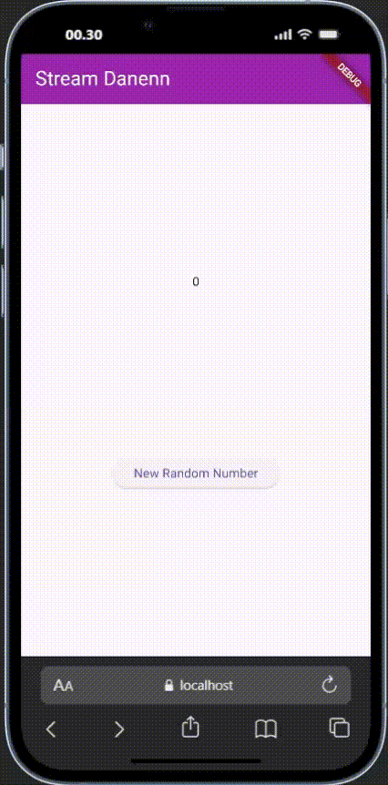
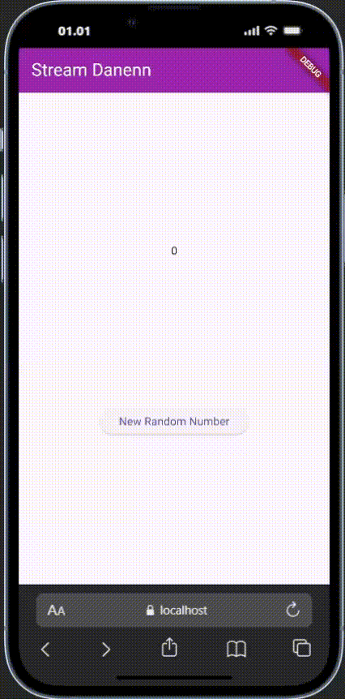
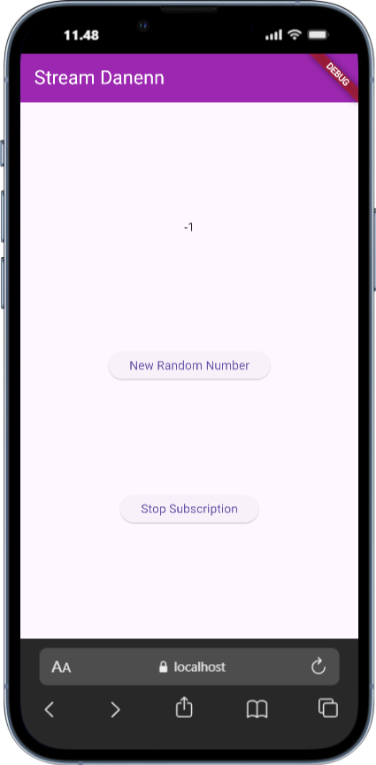
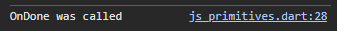
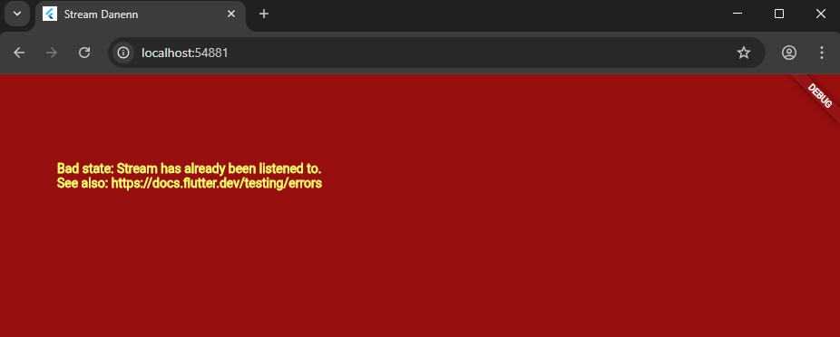
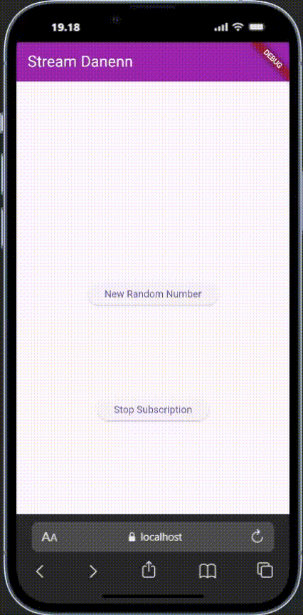
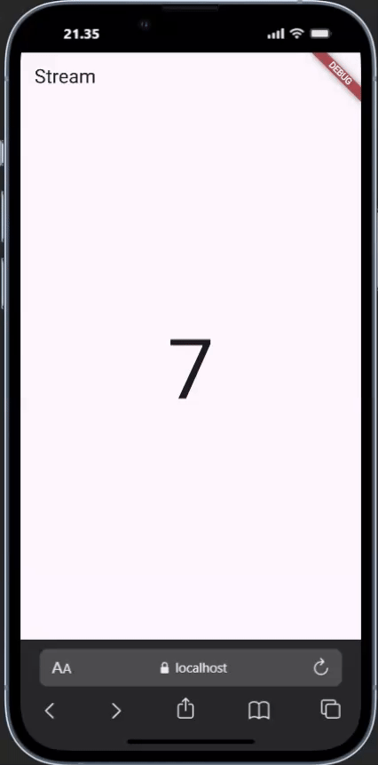

<h1 align="center">Laporan Praktikum Week 12 <br> 
<code>Streams</code>
</h1>
<h4>
Oleh: <br>

| Nama                     | Kelas | Absen |
| ------------------------ | ----- | ----- |
| Danendra Nayaka Passadhi | TI-3H | 07    |

## Tugas Praktikum 1: <br> `Dart Streams`

> **Soal 1** <br>
> Tambahkan nama panggilan Anda pada title app sebagai identitas hasil pekerjaan Anda.

```Dart
@override
  Widget build(BuildContext context) {
    return MaterialApp(
      title: 'Stream Danenn',
      theme: ThemeData(primarySwatch: Colors.deepPurple),
      home: const StreamHomePage(),
    );
  }
```

> **Soal 2** <br>
> Tambahkan 5 warna lainnya sesuai keinginan Anda pada variabel colors tersebut.

```Dart
  final List<Color> colors = [
    Colors.blueGrey,
    Colors.amber,
    Colors.deepPurple,
    Colors.lightBlue,
    Colors.teal,
    Colors.indigo,
    Colors.cyan,
    Colors.lime,
    Colors.pink,
    Colors.orange,
  ];
```

> **Soal 3** <br>
>
> - Jelaskan fungsi keyword yield\* pada kode tersebut!

↪ yield\* digunakan untuk mendelegasikan keluaran (delegate the output) dari generator function saat ini ke generator lain atau Stream atau Iterable. Pada kode program, generator akan menghasilkan elemen (warna) bukan satu per satu menggunakan yield, tetapi secara otomatis meneruskan semua elemen yang datang.

> - Apa maksud isi perintah kode tersebut?

↪ yield\*: Seperti dijelaskan di atas, ini adalah keyword yang mendelegasikan keluaran Stream ke fungsi generator saat ini. <br>
↪ Stream.periodic(const Duration(seconds: 1), (int t) { ... });: Menciptakan sebuah Stream tak terbatas yang menghasilkan event (warna) secara berulang. <br>
↪ int index = t % colors.length;: Menghitung indeks warna secara berputar (0, 1, 2, 0, 1, 2,...) sehingga daftar colors diulang terus-menerus. <br>
↪ return colors[index];: Mengambil elemen (warna) dari daftar colors pada index yang telah dihitung dan menjadikannya sebagai peristiwa yang dihasilkan oleh Stream.periodic.

> **Soal 4** <br>
> Capture hasil praktikum Anda berupa GIF dan lampirkan di README.



> **Soal 5** <br>
> Jelaskan perbedaan menggunakan listen dan await for (langkah 9) !

| **Fitur**                 | **`Stream.listen()`**                                                 | **`await for`**                                                          |
| ------------------------- | --------------------------------------------------------------------- | ------------------------------------------------------------------------ |
| **Aliran Kontrol**        | Non-blokir (Fire and Forget)                                          | Blokir (Menunggu setiap event secara berurutan)                          |
| **Diperlukan `async`**    | Tidak                                                                 | Ya, harus berada di fungsi `async`                                       |
| **Pengelolaan Langganan** | Manual (Perlu .cancel() di dispose())                                 | Otomatis (Berhenti saat Stream selesai/fungsi dibatalkan)                |
| **Kapan Digunakan**       | Untuk Stream yang berjalan lama/latar belakang, atau di widget state. | Untuk memproses Stream secara berurutan hingga selesai dalam satu scope. |

---

## Tugas Praktikum 2: <br> `Stream controllers dan sinks`

> **Soal 6** <br>
> Jelaskan maksud kode langkah 8 dan 10 tersebut!

↪ Langkah 8 bermaksud untuk menginisialisasi Stream, mulai berlangganan (subscribe) untuk menerima angka baru, dan memastikan antarmuka pengguna (UI) diperbarui setiap kali ada angka baru yang masuk. <br>
↪ Langkah 10 bermaksud untuk mendefinisikan cara untuk membuat angka acak baru dan memasukkannya ke dalam Stream. Setelah angka ini dikirim, callback stream.listen() pada Langkah 8 akan langsung menangkapnya dan memperbarui UI.

> Capture hasil praktikum Anda berupa GIF dan lampirkan di README.

<br>

> **Soal 7** <br>
> Jelaskan maksud kode langkah 13 sampai 15 tersebut!

↪ Tujuan dari Langkah 13 sampai 15 adalah untuk memastikan aplikasi
dapat menangani pengecualian (exceptions) yang dikirim melalui Stream. Ketika addRandomNumber() dipanggil sekarang, UI tidak akan menerima angka, tetapi akan memicu logika error handling yang disiapkan, membuktikan bahwa aplikasi Anda tahan terhadap kesalahan (robust).

> Kembalikan kode seperti semula pada Langkah 15, comment addError() agar Anda dapat melanjutkan ke praktikum 3 berikutnya.

```Dart
void addRandomNumber() {
  Random random = Random();
  int myNum = random.nextInt(10);
  numberStream.addNumberToSink(myNum);
  // numberStream.addError();
}
```

---

## Tugas Praktikum 3: <br> `Injeksi data ke streams`

> **Soal 8** <br>
> Jelaskan maksud kode langkah 1-3 tersebut!

- **Langkah 1**: Mendeklarasikan sebuah variabel instance bernama `transformer` di dalam `_StreamHomePageState`. Keyword late menunjukkan bahwa variabel ini akan diinisialisasi nanti (yaitu di `initState()`), sebelum digunakan. Variabel ini akan menyimpan objek yang bertanggung jawab untuk mengubah data Stream.
- **Langkah 2**: Mengalikan setiap angka yang masuk dengan 10, mengubah error menjadi angka -1, dan menutup Stream keluaran ketika Stream masukan selesai.
- **Langkah 3**: Stream asli dihubungkan melalui `transformer` untuk memetakan data dan menangani error internal. Widget kemudian mendengarkan (listen) Stream yang sudah diubah, memastikan `lastNumber` di UI diperbarui dengan nilai hasil transformasi (dikali 10) atau nilai -1 jika terjadi error.

> Capture hasil praktikum Anda berupa GIF dan lampirkan di README.

<br>

---

## Tugas Praktikum 4: <br> `Subscribe ke stream events`

> **Soal 9** <br>
> Jelaskan maksud kode langkah 2, 6 dan 8 tersebut!

- **Langkah 2**: Menyimpan `StreamSubscription` ini sangat penting karena objek inilah yang memberikan kendali untuk membatalkan (cancel) langganan `Stream` di kemudian hari, mencegah kebocoran memori.
- **Langkah 6**: Mencegah kebocoran memori (memory leak). Jika Anda tidak membatalkan langganan, `Stream` akan terus mencoba mengirimkan data ke widget yang sudah tidak ada, menghabiskan sumber daya.
- **Langkah 8**: Membuat aplikasi lebih robust (tahan banting) dengan mencegah kesalahan saat mencoba mengirim data ke `Stream` yang sudah ditutup. Aplikasi sekarang dapat bereaksi secara elegan jika pengguna mencoba memicu pengiriman data setelah `Stream` dihentikan.

> Capture hasil praktikum Anda berupa GIF dan lampirkan di README.

<br>

Hasil console: <br>


---

## Tugas Praktikum 5: <br> `Multiple stream subscriptions`

> **Soal 10** <br>
> Jelaskan mengapa error itu bisa terjadi ?


↪ Karena Stream ini dirancang hanya untuk memiliki satu listener aktif pada satu waktu. 
Setelah listener pertama mulai mendengarkan (.listen()), Stream dianggap "terkunci" (locked), dan listener kedua tidak dapat ditambahkan.

> **Soal 11** <br>
> Jelaskan mengapa hal itu bisa terjadi ?

↪ Karena Stream sekarang adalah Broadcast dan Anda memiliki dua listener yang keduanya memodifikasi variabel `values` yang sama, setiap angka yang dikirimkan akan ditambahkan ke string tampilan sebanyak dua kali.

> Capture hasil praktikum Anda berupa GIF dan lampirkan di README.

<br>

---

## Tugas Praktikum 6: <br> `Multiple stream subscriptionsStreamBuilder`

> **Soal 12** <br>
> Jelaskan maksud kode pada langkah 3 dan 7 !

↪ Langkah 3: Menciptakan sebuah sumber data (Source Stream) yang secara terus-menerus memancarkan angka acak baru (0-9) ke Stream setiap satu detik. <br>
↪ Langkah 7: Mendengarkan data secara otomatis dari `numberStream`. Setiap kali angka acak baru datang (setiap detik), StreamBuilder akan membangun ulang (re-render) bagian UI yang menampilkan angka tersebut, sehingga angkanya diperbarui di layar secara reaktif.

> Capture hasil praktikum Anda berupa GIF dan lampirkan di README.

<br>