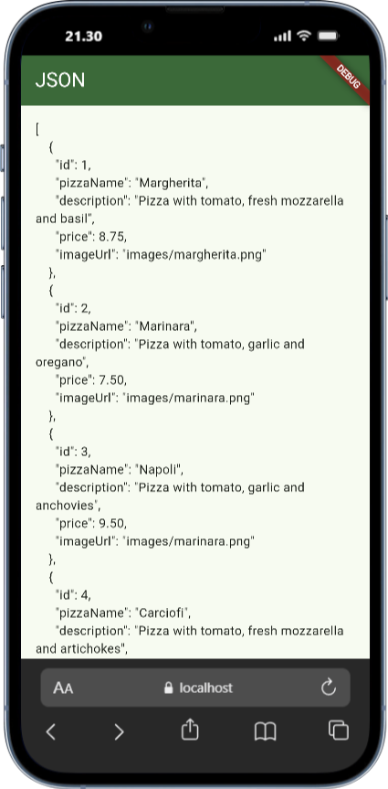
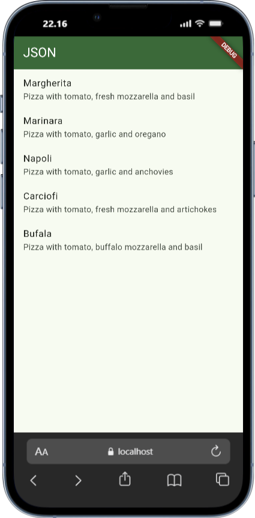
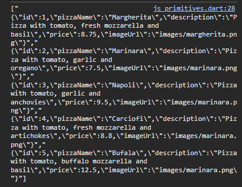
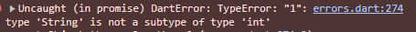
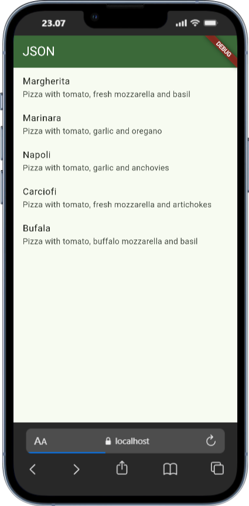
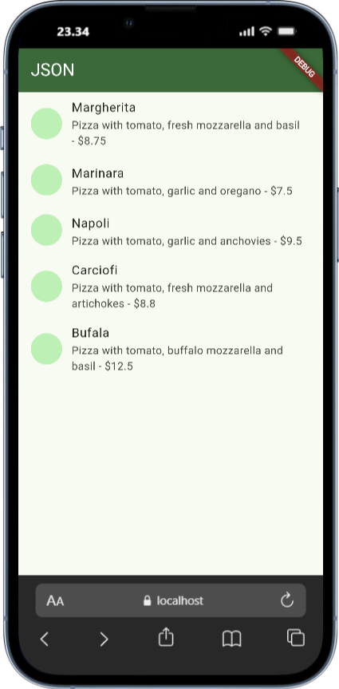
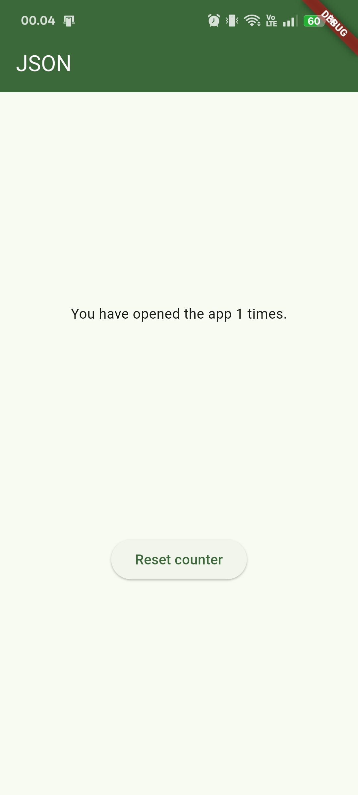
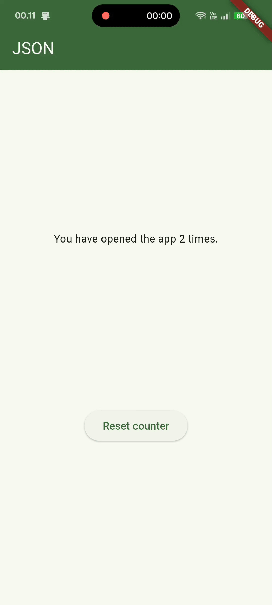
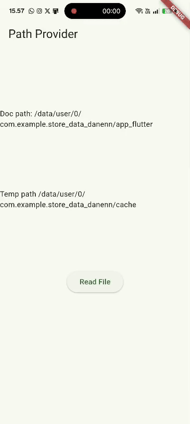

<h1 align="center">Laporan Praktikum Week 13 <br> 
<code>Persistensi Data</code>
</h1>
<h4>
Oleh: <br>

| Nama                     | Kelas | Absen |
| ------------------------ | ----- | ----- |
| Danendra Nayaka Passadhi | TI-3H | 07    |

## Tugas Praktikum 1: <br> `Konversi Dart model ke JSON`

> **Soal 1** <br>
>
> - Tambahkan nama panggilan Anda pada title app sebagai identitas hasil pekerjaan Anda.
> - Gantilah warna tema aplikasi sesuai kesukaan Anda.

```Dart
  @override
  Widget build(BuildContext context) {
    return MaterialApp(
      title: 'Flutter JSON Demo by Danenn',
      theme: ThemeData(
        primarySwatch: Colors.green,
      ),
      home: const MyHomePage(),
    );
  }
}
```

> **Soal 2** <br>
> Masukkan hasil capture layar ke laporan praktikum Anda.



> **Soal 3** <br>
> Masukkan hasil capture layar ke laporan praktikum Anda.



### Output Konsol:


---

## Tugas Praktikum 2: <br> `Handle kompatibilitas data JSON`

### Langkah 1: Simulasikan Error

```JSON
    { 
      "id": "1", 
      "pizzaName": "Margherita", 
    }
```

### Langkah 2: Lihat Error Tipe Data String ke Int

<br>

> **Soal 4** <br>
> Capture hasil running aplikasi Anda, kemudian impor ke laporan praktikum Anda!



---

## Tugas Praktikum 3: <br> `Menangani error JSON`

> **Soal 5** <br>
> - Jelaskan maksud kode lebih safe dan maintainable!

↪ Maksudnya adalah lebih safe/aman dari kesalahan manusia (Human Error) atau bug dan lebih mudah melakukan perubahan pada JSON karena hanya perlu pergantian kode pada satu tempat saja, yaitu pada deklarasi konstanta.

> - Capture hasil running aplikasi Anda, kemudian impor ke laporan praktikum Anda!



---

## Tugas Praktikum 4: <br> `SharedPreferences`
### Hasil Langkah 1-12



### Hasil Langkah 13-15
> **Soal 6** <br>
> Capture hasil praktikum Anda berupa GIF dan lampirkan di README.



---

## Tugas Praktikum 5: <br> `Akses filesystem dengan path_provider`

> **Soal 7** <br>
> Capture hasil praktikum Anda dan lampirkan di README.


---

## Tugas Praktikum 6: <br> `Akses filesystem dengan direktori`

> **Soal 8** <br>
> - Jelaskan maksud kode pada langkah 3 dan 7 !

↪ **Langkah 3**: Maksudnya langkah ini adalah membuat sebuah fungsi yang bertugas untuk menulis (menyimpan) data teks ke dalam sebuah file di penyimpanan perangkat. <br>
↪ **Langkah 7**: Maksudnya langkah ini adalah tahap verifikasi atau pembuktian bahwa kode yang telah ditulis pada Langkah 3, 4, 5, dan 6 bekerja dengan benar. Kemudian ketika menekan button fungsi `readFile()` akan membuka file yang tadi ditulis dan mengambil teksnya untuk memperbarui layar dengan `setstate` yang memunculkan nama dan NIM.

> - Capture hasil praktikum Anda berupa GIF dan lampirkan di README.

