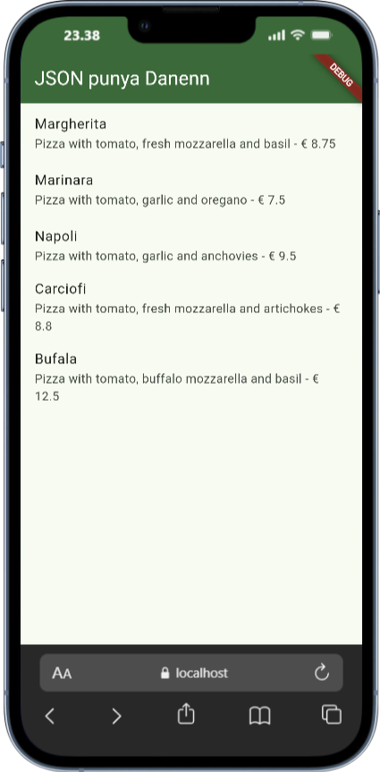
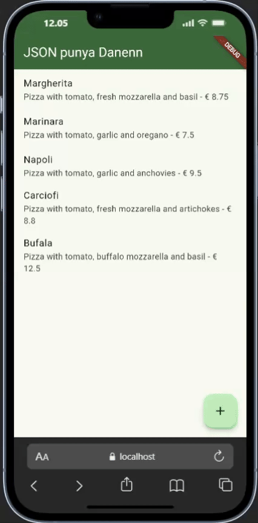
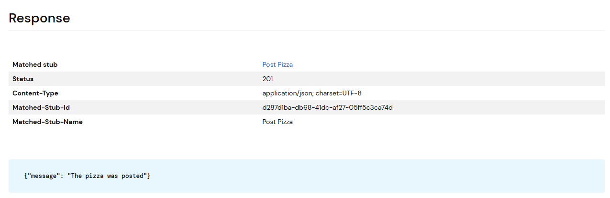

<h1 align="center">Laporan Praktikum Week 14 <br> 
<code>RESTful API</code>
</h1>
<h4>
Oleh: <br>

| Nama                     | Kelas | Absen |
| ------------------------ | ----- | ----- |
| Danendra Nayaka Passadhi | TI-3H | 07    |

## Tugas Praktikum 1: <br> `Membuat layanan Mock API`

> **Soal 1** <br>
> - Tambahkan nama panggilan Anda pada title app sebagai identitas hasil pekerjaan Anda.
> - Gantilah warna tema aplikasi sesuai kesukaan Anda.

```Dart
return MaterialApp(
    title: 'Flutter JSON Demo by Danenn',
    theme: ThemeData(
    colorScheme: ColorScheme.fromSeed(seedColor: Colors.green),
    useMaterial3: true,
    ),
    home: const MyHomePage(),
);
```

> - Capture hasil aplikasi Anda, lalu masukkan ke laporan di README



**Di file httphelper.dart, tambahkan kode berikut ke kelas HttpHelper, tepat di bawah deklarasi:**
```Dart
class HttpHelper {
  static final HttpHelper _httpHelper = HttpHelper._internal();
  HttpHelper._internal();
  factory HttpHelper() {
    return _httpHelper;
  }
  ...
```

---

## Tugas Praktikum 2: <br> `Mengirim Data ke Web Service (POST)`

> **Soal 2** <br>
> - Tambahkan field baru dalam JSON maupun POST ke Wiremock!
> - Capture hasil aplikasi Anda berupa GIF di README


<br><br>

**Tampilan pada Wiremock**

